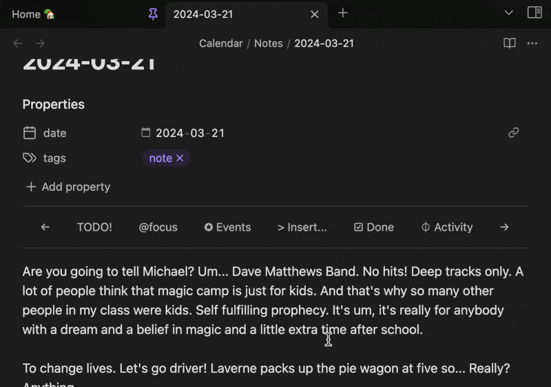

   

**[English](./README.md) | [中文文档](./README-ZH.md) | [日本語](./README-JA.md)**

[Note Toolbar plugin](https://obsidian.md/plugins?id=note-toolbar) for [Obsidian](https://obsidian.md) を使用すると、ノートごとに最適なツールバーを作成できます。ツールバーには、コマンド、ファイルやフォルダへのリンク、ウェブサイト（URI）、メニュー、さらにはスクリプト（Dataview、Templater、JavaScript）を自由に配置することが可能です。

> 更新情報？ [リリースノート](https://github.com/chrisgurney/obsidian-note-toolbar/releases)をご覧ください
> 
> 今後の予定は、[ロードマップ](https://github.com/chrisgurney/obsidian-note-toolbar/wiki/Roadmap)をご覧ください

**目次:**

- [機能](#機能)
- [インストール](#インストール)
- [はじめに](#はじめに-)
- [ギャラリー](#ギャラリー)
- [ユーザーガイド](#ユーザーガイド)

# スクリーンショット

*スクロール時にツールバーを上部に固定できます:*

*テキスト選択時にツールバーを表示:*

*モバイルでのオプション:*

# 機能

_🏆 2024年 Obsidian Gems of the Year（新規プラグイン部門） ランナーアップ_

- [ツールバーの作成](https://github.com/chrisgurney/obsidian-note-toolbar/wiki/Creating-toolbars): コマンド、ファイル/フォルダ、URI/URL、メニュー、[scripts](https://github.com/chrisgurney/obsidian-note-toolbar/wiki/Executing-scripts)（Dataview、JS Engine、Templater、組み込みのJavaScript）などへのリンクを持つアイテムでツールバーを作成できます。
  - 内蔵の[ギャラリー（100個以上のアイテム）](https://github.com/chrisgurney/obsidian-note-toolbar/wiki/Gallery)から、数回のクリックで項目をツールバーに追加できます。
- [ツールバーの見えかたを定義](https://github.com/chrisgurney/obsidian-note-toolbar/wiki/Defining-where-to-show-toolbars): フォルダやユーザー定義のプロパティに基づいて、ツールバーをどこにどのように表示するかを定義できます。
  - [各ツールバーの位置](https://github.com/chrisgurney/obsidian-note-toolbar/wiki/Positioning-toolbars)を、プロパティ欄の下、ノートの上部や下部、タブバー、フローティングボタンなどから選べます。
  - [テキスト選択時に表示されるツールバーを設定](https://github.com/chrisgurney/obsidian-note-toolbar/wiki/Toolbars-within-the-app#Selected-text)できます。
  - _新規タブ_ ビューにツールバーを追加したり、[新規タブビュー自体をランチパッドとして完全に置き換えること](https://github.com/chrisgurney/obsidian-note-toolbar/wiki/Toolbars-within-the-app#New-tab-view) もできます。
  - モバイルではナビゲーションバーからツールバーへアクセスできます。
- Obsidianの組み込みアイコン、絵文字を含むラベル、またはその両方を使用できます。
  - 各項目に任意のツールチップを設定できます。
  - 項目の表示をモバイル／デスクトップで個別に指定できます。
  - アイコンのみ／ラベルのみ／両方を表示するか選べます。
- [変数](https://github.com/chrisgurney/obsidian-note-toolbar/wiki/Variables)やスクリプト式を使って、ノートのタイトルやプロパティなどを項目ラベル、ツールチップ、URIに差し込めます。
- [Note Toolbar Callouts](https://github.com/chrisgurney/obsidian-note-toolbar/wiki/Note-Toolbar-Callouts)を使えば、ノート内の任意の場所にツールバーを作成・配置できます。
- ツールバーをリンクやコールアウトとして他のユーザーと[共有](https://github.com/chrisgurney/obsidian-note-toolbar/wiki/Sharing-toolbars)できます（共有リンク／[コールアウト](https://github.com/chrisgurney/obsidian-note-toolbar/wiki/Creating-callouts-from-toolbars)として）。
- 境界線の追加、スクロール時の上部固定、自動非表示、モバイルでの折り返し設定、ボタン風やタブ風の表示、左寄せ・中央・右寄せ・均等配置など、[スタイルを細かく設定](https://github.com/chrisgurney/obsidian-note-toolbar/wiki/Styling-toolbars)できます。
  - モバイル用のスタイルを個別に上書きできます。
  - フローティングボタンや[ナビゲーションバー](https://github.com/chrisgurney/obsidian-note-toolbar/wiki/Navigation-bar)で任意のアイコンを使用できます（モバイル）。
  - [Style Settings Plugin](https://github.com/chrisgurney/obsidian-note-toolbar/wiki/Style-Settings-plugin-support)と連携して、色・位置・サイズ等をさらに細かくカスタマイズできます。
- 任意のツールバーや項目を開く[コマンドを追加](https://github.com/chrisgurney/obsidian-note-toolbar/wiki/Commands)できます。組み込みコマンドでノートプロパティを完全に非表示にしたり、 [Quick Tools](https://github.com/chrisgurney/obsidian-note-toolbar/wiki/Quick-Tools)でツールバーへ素早くアクセスしたり、コマンドURIを取得することが可能です。
- [Note Toolbar URIs](https://github.com/chrisgurney/obsidian-note-toolbar/wiki/Note-Toolbar-URIs) により、コマンド実行、フォルダへのフォーカス、メニュー表示（Callouts内）、ツールバー設定の表示などをノート内の様々な場所から行えます。
- [キーボード操作](https://github.com/chrisgurney/obsidian-note-toolbar/wiki/Accessibility)（_Note Toolbar: Focus_ コマンド）でのアクセシビリティをサポートします。
- ツールバーを右クリックして他のツールバーと入れ替えたり、位置・スタイルの変更や設定へのクイックアクセスができます。
- [Note Toolbar API](https://github.com/chrisgurney/obsidian-note-toolbar/wiki/Note-Toolbar-API)により、ツールバーの操作やサジェスター／プロンプト／メニュー／モーダルなどのUI表示が可能です。これにより Dataview JS、JS Engine、Templater のスクリプトがユーザー入力を求めたり情報を表示したりできます。

# 翻訳 🌐

Note ToolbarのUIとStyle Settingsのオプションは、以下の言語でも利用できます：

|Language name|Native name|Contributors|
|---|---|---|
|Chinese (Simplified)|简体中文|[@Moyf](https://github.com/Moyf)|
|German|Deutsch|[@hartimd](https://github.com/hartimd)|
|Ukrainian|Український|[@Laktiv](https://github.com/laktiv)|
|Japanese|日本語|[@dai](https://github.com/dai)|

[翻訳の追加にご協力ください。](https://github.com/chrisgurney/obsidian-note-toolbar/wiki/Help-translate-Note-Toolbar-%F0%9F%8C%90)

# インストール

[こちらをクリック](https://obsidian.md/plugins?id=note-toolbar)するか、以下の手順に従ってください：

1. Obsidianの設定を開き、_コミュニティプラグイン_ をクリックします
2. _Note Toolbar_ を検索して選択します
3. _インストール_ をクリックします
4. プラグインを _有効化_ してください

BRATを使用してベータ版をインストール

 
<a href="https://github.com/TfTHacker/obsidian42-brat">BRAT</a>を使用すると、プラグインのベータテストを行い、フィードバックを提供できます。 
 
ベータ版が利用可能になったら、<a href="https://github.com/chrisgurney/obsidian-note-toolbar/discussions">フィードバック</a>や見つけた<a href="https://github.com/chrisgurney/obsidian-note-toolbar/issues">問題</a>をお寄せください！ 
 
<em>免責事項: ベータ版はプラグインのプレリリース版です。作業を進める前に、Note Toolbarの<code>data.json</code>ファイルのバックアップを作成するか、別のVault内でテストすることを強くお勧めします（ベータ版の性質によります）。</em> 
 
<blockquote>
  <ol>
    <li>BRATプラグインをインストール: 
      <ul>
        <li><i>設定 > コミュニティプラグイン</i>を開きます</li>
        <li>有効になっている場合は、<i>セーフモードを無効化</i>します</li>
        <li>参照して、<i>「BRAT」を検索</i>します</li>
        <li><i>Obsidian 42 - BRAT</i>の最新バージョンをインストールします</li>
      </ul></li>
    <li>BRATの設定を開きます（<i>設定 -> Obsidian 42 - BRAT</i>）</li>
    <li><i>Beta Plugin List</i>セクションまでスクロールします</li>
    <li><i>Add Beta Plugin</i>をクリックします</li>
    <li>このリポジトリを指定: <code>chrisgurney/obsidian-note-toolbar</code></li>
    <li><i>Note Toolbarプラグインを有効化</i>します（<i>設定 &gt; コミュニティプラグイン</i>）</li>
    <li>Obsidianを再起動するか、Vaultを再度開きます。</li>
    <li>Note Toolbarの設定で、上部のバージョン番号が最新のベータ版であることを確認します。</li>
  </ol>
</blockquote>

# はじめに 🚀

有効化したら、Note Toolbarの設定を開きます: 

1. _+ 新しいツールバー_ を作成します
2. ツールバーに _名前_ を付けます。
3. _+ 追加_ をクリックします（または[ギャラリー](https://github.com/chrisgurney/obsidian-note-toolbar/wiki/Gallery)を検索）
4. 設定を閉じて、_ノートを開きます_ 。
5. `notetoolbar`プロパティを追加します。ツールバーの名前に設定します。

プロパティを**使用せずに** ツールバーを表示したい場合は、フォルダ（デイリーノートが保存されている場所など）を新しいツールバーにマッピングしてみてください。

# 例

📖 詳細な手順やヒントについては[ユーザーガイド](https://github.com/chrisgurney/obsidian-note-toolbar/wiki)を、例については[ディスカッション](https://github.com/chrisgurney/obsidian-note-toolbar/discussions/categories/show-and-tell)をご覧ください。

# ギャラリー

ギャラリーでは、数回のクリック/タップでツールバーに追加できる **[100個以上のアイテム](https://github.com/chrisgurney/obsidian-note-toolbar/wiki/Gallery)を探索** できます。

# ユーザーガイド

📖 詳細な手順、ヒント、その他の情報については、**[ユーザーガイド](https://github.com/chrisgurney/obsidian-note-toolbar/wiki)をご覧ください**。

Note Toolbarの設定のスクリーンショット: 

# ライセンス

Note ToolbarはGPL 3.0の下でライセンスされています。詳細は[LICENSE](https://github.com/chrisgurney/obsidian-note-toolbar/blob/master/LICENSE)をご覧ください。

# インスピレーションと謝辞 🙏

このプラグインの開発中に質問に答えてくれた他のプロジェクトや人々に感謝します：

- Obsidianの[Sample Plugin](https://github.com/obsidianmd/obsidian-sample-plugin)、[開発者ドキュメント](https://docs.obsidian.md/)、および[このプレイリスト](https://www.youtube.com/playlist?list=PLIDCb22ZUTBnMCbJa-st4PD5T3Olep078)。
- [Templater](https://github.com/SilentVoid13/Templater) - 特に設定周りのコードについて。
- [Periodic Notes](https://github.com/liamcain/obsidian-periodic-notes/) - コードについて、そしてこのプラグインが私自身のニーズに合う理由の1つ...そしてliam.cainの助けに感謝！
- [BRAT](https://github.com/TfTHacker/obsidian42-brat) - このプラグインのベータテストの手段を提供してくれました。
- [Obsidian Discord](https://discord.gg/obsidianmd)の#plugin-devチャンネルのすべての方々、その時間とドキュメントに感謝します。特に：claremacrae、dovos、lemons_dev、liam.cain、joethei、sailKite、SkepticMystic

# Contribute 🧑‍💻

[アイデアの議論](https://github.com/chrisgurney/obsidian-note-toolbar/discussions)を歓迎します！プルリクエストも大歓迎です！

[翻訳の追加やレビューにご協力ください。](https://github.com/chrisgurney/obsidian-note-toolbar/wiki/Help-translate-Note-Toolbar-%F0%9F%8C%90)

# サポート 🛟

📖  **[ユーザーガイド](https://github.com/chrisgurney/obsidian-note-toolbar/wiki)の[トラブルシューティング](https://github.com/chrisgurney/obsidian-note-toolbar/Troubleshooting)をご覧ください。** 

[質問はこちら](https://github.com/chrisgurney/obsidian-note-toolbar/discussions)または[機能をリクエスト](https://github.com/chrisgurney/obsidian-note-toolbar/discussions/categories/ideas)してください。バグと思われるものに遭遇した場合は、[問題を報告](https://github.com/chrisgurney/obsidian-note-toolbar/issues)してください。

このプラグインが役立つと感じ、経済的にサポートしたい場合は、[寄付を受け付けています](https://buymeacoffee.com/cheznine)。ありがとうございます！

