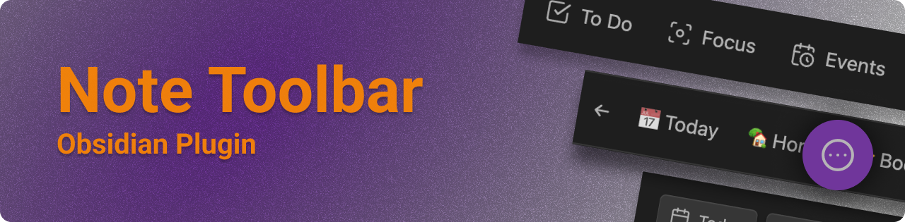
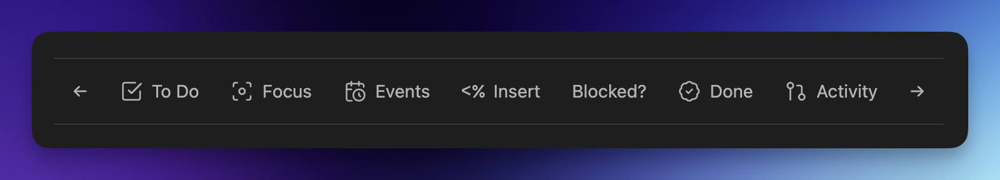
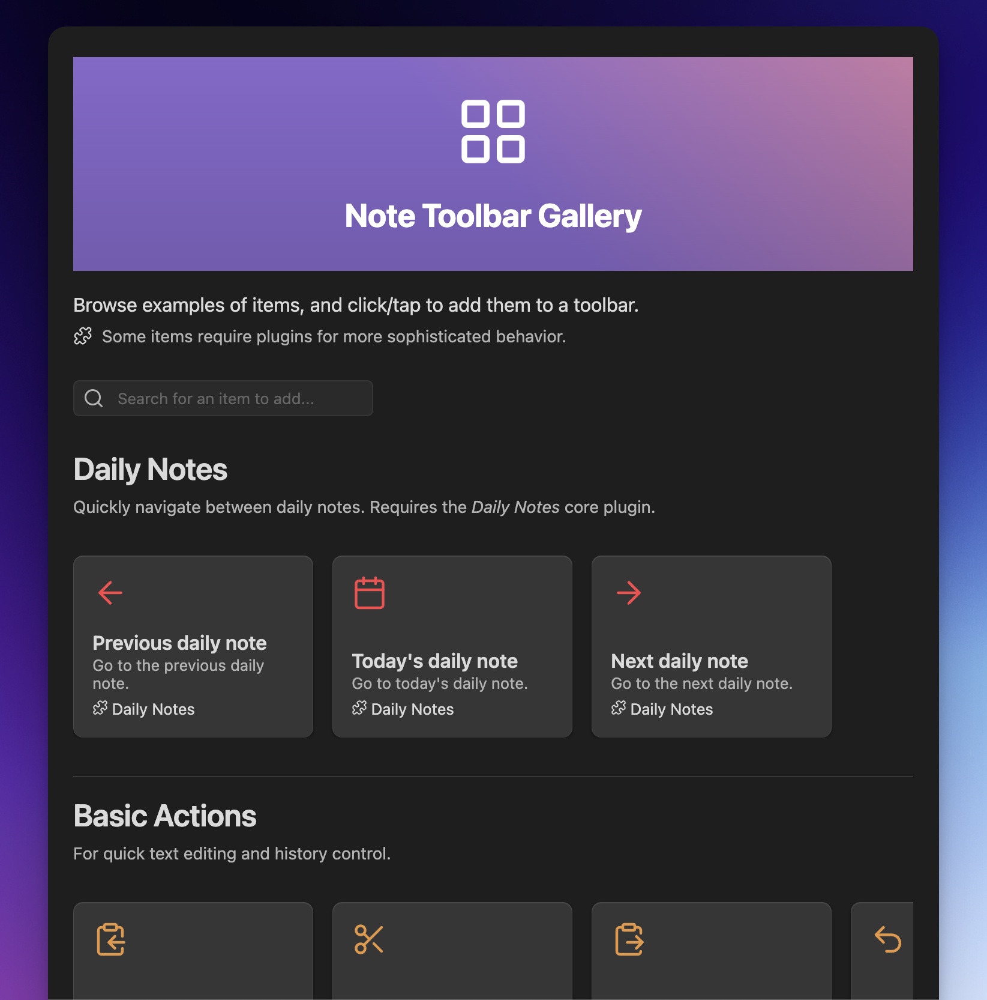
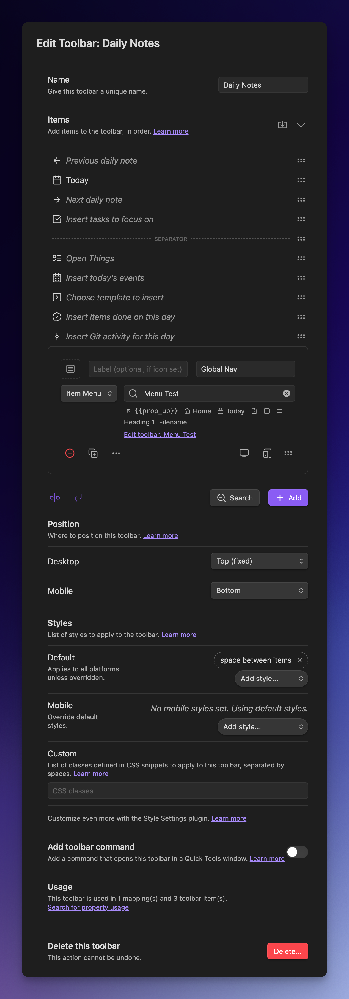

   

[English](./README.md) | [中文文档](./README-ZH.md) | [日本語](./README-JA.md)

The [Note Toolbar plugin](https://obsidian.md/plugins?id=note-toolbar) for [Obsidian](https://obsidian.md) lets you create context-aware toolbars for your notes, which can include commands, file and folder links, websites/URIs, menus, and scripts (Dataview, Templater, and JavaScript).

> 更新情報？ [リリースノート](https://github.com/chrisgurney/obsidian-note-toolbar/releases)をご覧ください
> 
> 今後の予定は、[ロードマップ](https://github.com/chrisgurney/obsidian-note-toolbar/wiki/Roadmap)をご覧ください

**目次:**

- [機能](#機能)
- [インストール](#インストール)
- [はじめに](#はじめに-)
- [ギャラリー](#ギャラリー)
- [ユーザーガイド](#ユーザーガイド)

# スクリーンショット

*スクロール時にツールバーを上部に固定できます:*

*テキスト選択時にツールバーを表示:*

*モバイルでのオプション:*

# 機能

_🏆 Runner up in the Obsidian Gems of the Year 2024: New plugins category._

- [Create toolbars](https://github.com/chrisgurney/obsidian-note-toolbar/wiki/Creating-toolbars) with items that link to commands, files/folders, URIs/URLs, menus, and [scripts](https://github.com/chrisgurney/obsidian-note-toolbar/wiki/Executing-scripts) (Dataview, JS Engine, Templater, and built-in support for JavaScript).
  - Built-in [Gallery of 100+ items](https://github.com/chrisgurney/obsidian-note-toolbar/wiki/Gallery) that can be added to your toolbars in just a couple clicks/taps.
- [Define where and how toolbars are displayed](https://github.com/chrisgurney/obsidian-note-toolbar/wiki/Defining-where-to-show-toolbars): Based on their folders, or a user-defined property.
  - [Position each toolbar](https://github.com/chrisgurney/obsidian-note-toolbar/wiki/Positioning-toolbars) below the Properties section, at the top or bottom of notes, in the tab bar, or as a floating button.
  - [Show a toolbar when text is selected.](https://github.com/chrisgurney/obsidian-note-toolbar/wiki/Toolbars-within-the-app#Selected-text)
  - Add a toolbar to the _New tab_ view, or [completely replace the New tab view](https://github.com/chrisgurney/obsidian-note-toolbar/wiki/Toolbars-within-the-app#New-tab-view) as a launchpad for your vault.
  - Access the toolbar from the navigation bar (on mobile).
- Use Obsidian's built-in icons, labels (which can include emojis), or a mix of both.
  - Set optional tooltips for each item.
  - Show items specifically on mobile, desktop, or both.
  - Choose whether the icon, label, or both are displayed.
- Use [variables](https://github.com/chrisgurney/obsidian-note-toolbar/wiki/Variables) or script experssions to sub in the note's title or properties and more into toolbar item labels, tooltips, and URIs.
- [Note Toolbar Callouts](https://github.com/chrisgurney/obsidian-note-toolbar/wiki/Note-Toolbar-Callouts) let you create and place toolbars anywhere within your notes.
- [Share toolbars](https://github.com/chrisgurney/obsidian-note-toolbar/wiki/Sharing-toolbars) with other users with a link, or [as callouts](https://github.com/chrisgurney/obsidian-note-toolbar/wiki/Creating-callouts-from-toolbars).
- [Style toolbars](https://github.com/chrisgurney/obsidian-note-toolbar/wiki/Styling-toolbars) by adding borders, sticking to the top of your note on scroll, auto-hiding, choosing whether or not the toolbar should wrap (on mobile), making items look like buttons or act like tabs, and aligning items (left, right, centered, evenly spaced).
  - Change or override these styles on mobile (i.e, phone and tablet).
  - Use any icon for the floating button or [nav bar](https://github.com/chrisgurney/obsidian-note-toolbar/wiki/Navigation-bar) (on mobile).
  - Or use the [Style Settings plugin](https://github.com/chrisgurney/obsidian-note-toolbar/wiki/Style-Settings-plugin-support) for even more options (colors, positioning, sizing, etc.).
- Add [commands](https://github.com/chrisgurney/obsidian-note-toolbar/wiki/Commands) to open any toolbar, or to execute any item. Built-in commands _completely_ hide note properties, quickly access toolbars with [Quick Tools](https://github.com/chrisgurney/obsidian-note-toolbar/wiki/Quick-Tools), get command URIs, and more.
- [Note Toolbar URIs](https://github.com/chrisgurney/obsidian-note-toolbar/wiki/Note-Toolbar-URIs) let you execute commands, focus on folders, open menus (within Note Toolbar Callouts), and open toolbar settings, from mostly anywhere within your notes.
- [Keyboard controls](https://github.com/chrisgurney/obsidian-note-toolbar/wiki/Accessibility) available via the _Note Toolbar: Focus_ command
- Right-click toolbars to swap with other toolbars, quickly change the position, style, or to access configuration.
- The [Note Toolbar API](https://github.com/chrisgurney/obsidian-note-toolbar/wiki/Note-Toolbar-API) provides toolbar access, and the ability to show UI (suggesters, prompts, menus, and modals). The latter enables Dataview JS, JS Engine, or Templater scripts to ask for information, or to show helpful text.

# 翻訳 🌐

Note ToolbarのUIとStyle Settingsのオプションは、以下の言語でも利用できます：

|言語名|母語名|貢献者|
|---|---|---|
|中国語（簡体字）|简体中文|[@Moyf](https://github.com/Moyf)|
|ドイツ語|Deutsch|[@hartimd](https://github.com/hartimd)|
|ウクライナ語|Український|[@Laktiv](https://github.com/laktiv)|

[翻訳の追加にご協力ください。](https://github.com/chrisgurney/obsidian-note-toolbar/wiki/Help-translate-Note-Toolbar-%F0%9F%8C%90)

# インストール

[こちらをクリック](https://obsidian.md/plugins?id=note-toolbar)するか、以下の手順に従ってください：

1. Obsidianの設定を開き、_コミュニティプラグイン_をクリックします
2. _Note Toolbar_を検索して選択します
3. _インストール_をクリックします
4. プラグインを_有効化_してください

BRATを使用してベータ版をインストール

 
<a href="https://github.com/TfTHacker/obsidian42-brat">BRAT</a>を使用すると、プラグインのベータテストを行い、フィードバックを提供できます。 
 
ベータ版が利用可能になったら、<a href="https://github.com/chrisgurney/obsidian-note-toolbar/discussions">フィードバック</a>や見つけた<a href="https://github.com/chrisgurney/obsidian-note-toolbar/issues">問題</a>をお寄せください！ 
 
<em>免責事項：ベータ版はプラグインのプレリリース版です。作業を進める前に、Note Toolbarの<code>data.json</code>ファイルのバックアップを作成するか、別のVault内でテストすることを強くお勧めします（ベータ版の性質によります）。</em> 
 
<blockquote>
  <ol>
    <li>BRATプラグインをインストール：
      <ul>
        <li><i>設定 > コミュニティプラグイン</i>を開きます</li>
        <li>有効になっている場合は、<i>セーフモードを無効化</i>します</li>
        <li>参照して、<i>「BRAT」を検索</i>します</li>
        <li><i>Obsidian 42 - BRAT</i>の最新バージョンをインストールします</li>
      </ul></li>
    <li>BRATの設定を開きます（<i>設定 -> Obsidian 42 - BRAT</i>）</li>
    <li><i>Beta Plugin List</i>セクションまでスクロールします</li>
    <li><i>Add Beta Plugin</i>をクリックします</li>
    <li>このリポジトリを指定：<code>chrisgurney/obsidian-note-toolbar</code></li>
    <li><i>Note Toolbarプラグインを有効化</i>します（<i>設定 &gt; コミュニティプラグイン</i>）</li>
    <li>Obsidianを再起動するか、Vaultを再度開きます。</li>
    <li>Note Toolbarの設定で、上部のバージョン番号が最新のベータ版であることを確認します。</li>
  </ol>
</blockquote>

# はじめに 🚀

有効化したら、Note Toolbarの設定を開きます：

1. _+ 新しいツールバー_を作成します
2. ツールバーに_名前_を付けます。
3. _+ 追加_をクリックします（または[ギャラリー](https://github.com/chrisgurney/obsidian-note-toolbar/wiki/Gallery)を検索）
4. 設定を閉じて、_ノートを開きます_。
5. `notetoolbar`プロパティを追加します。ツールバーの名前に設定します。

プロパティを使用_せずに_ツールバーを表示したい場合は、フォルダ（デイリーノートが保存されている場所など）を新しいツールバーにマッピングしてみてください。

# 例

📖 詳細な手順やヒントについては[ユーザーガイド](https://github.com/chrisgurney/obsidian-note-toolbar/wiki)を、例については[ディスカッション](https://github.com/chrisgurney/obsidian-note-toolbar/discussions/categories/show-and-tell)をご覧ください。

# ギャラリー

ギャラリーでは、数回のクリック/タップでツールバーに追加できる**[100個以上のアイテム](https://github.com/chrisgurney/obsidian-note-toolbar/wiki/Gallery)を探索**できます。

# ユーザーガイド

📖 詳細な手順、ヒント、その他の情報については、**[ユーザーガイド](https://github.com/chrisgurney/obsidian-note-toolbar/wiki)をご覧ください**。

Note Toolbarの設定のスクリーンショット：

# ライセンス

Note ToolbarはGPL 3.0の下でライセンスされています。詳細は[LICENSE](https://github.com/chrisgurney/obsidian-note-toolbar/blob/master/LICENSE)をご覧ください。

# インスピレーションと謝辞 🙏

このプラグインの開発中に質問に答えてくれた他のプロジェクトや人々に感謝します：

- Obsidianの[Sample Plugin](https://github.com/obsidianmd/obsidian-sample-plugin)、[開発者ドキュメント](https://docs.obsidian.md/)、および[このプレイリスト](https://www.youtube.com/playlist?list=PLIDCb22ZUTBnMCbJa-st4PD5T3Olep078)。
- [Templater](https://github.com/SilentVoid13/Templater) - 特に設定周りのコードについて。
- [Periodic Notes](https://github.com/liamcain/obsidian-periodic-notes/) - コードについて、そしてこのプラグインが私自身のニーズに合う理由の1つ...そしてliam.cainの助けに感謝！
- [BRAT](https://github.com/TfTHacker/obsidian42-brat) - このプラグインのベータテストの手段を提供してくれました。
- [Obsidian Discord](https://discord.gg/obsidianmd)の#plugin-devチャンネルのすべての方々、その時間とドキュメントに感謝します。特に：claremacrae、dovos、lemons_dev、liam.cain、joethei、sailKite、SkepticMystic

# Contribute 🧑‍💻

[アイデアの議論](https://github.com/chrisgurney/obsidian-note-toolbar/discussions)を歓迎します！プルリクエストも大歓迎です！

[翻訳の追加やレビューにご協力ください。](https://github.com/chrisgurney/obsidian-note-toolbar/wiki/Help-translate-Note-Toolbar-%F0%9F%8C%90)

# サポート 🛟

📖 **[ユーザーガイド](https://github.com/chrisgurney/obsidian-note-toolbar/wiki)の[トラブルシューティング](https://github.com/chrisgurney/obsidian-note-toolbar/Troubleshooting)をご覧ください。**

[質問はこちら](https://github.com/chrisgurney/obsidian-note-toolbar/discussions)または[機能をリクエスト](https://github.com/chrisgurney/obsidian-note-toolbar/discussions/categories/ideas)してください。バグと思われるものに遭遇した場合は、[問題を報告](https://github.com/chrisgurney/obsidian-note-toolbar/issues)してください。

このプラグインが役立つと感じ、経済的にサポートしたい場合は、[寄付を受け付けています](https://buymeacoffee.com/cheznine)。ありがとうございます！

