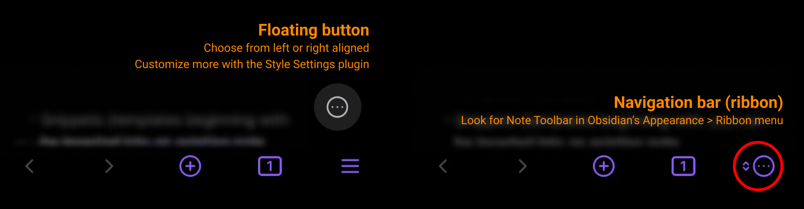
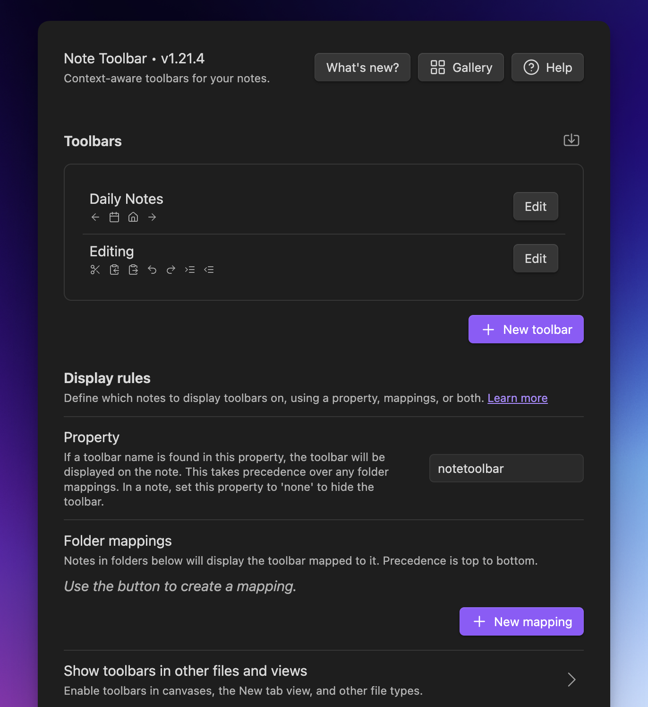

    

**[English](./README.md) | [中文文档](./README-ZH.md) | [日本語](./README-JA.md)**

这是一个为 [Obsidian](https://obsidian.md) 设计的笔记工具栏插件，用于创建基于上下文感知的工具栏（根据当前笔记灵活显示不同的操作项）；工具栏提供执行命令、快速跳转库内文件/文件夹、打开网站/URI、显示菜单甚至运行脚本（支持 Dataview, Templater 和 JavaScript）等功能。

> 最新动态？查看 [发布说明](https://github.com/chrisgurney/obsidian-note-toolbar/releases)
> 
> 未来计划？查看 [路线图](https://github.com/chrisgurney/obsidian-note-toolbar/wiki/Roadmap)

**快速跳转：**

- [功能](#功能)
- [安装](#安装)
- [快速入门 🚀](#快速入门-)
- [示例库](https://github.com/chrisgurney/obsidian-note-toolbar/wiki/Gallery)
- [用户指南](https://github.com/chrisgurney/obsidian-note-toolbar/wiki)

针对移动端的更多选项：

# 功能

_🏆 荣获 2024 年度 Obsidian 新星插件（亚军）_

- [创建工具栏](https://github.com/chrisgurney/obsidian-note-toolbar/wiki/Creating-toolbars)：包含命令、文件/文件夹、URI/URL、菜单和[脚本](https://github.com/chrisgurney/obsidian-note-toolbar/wiki/Executing-scripts)（Dataview、JS Engine、Templater 及原生的 JavaScript 支持）
  - 内置 [100+ 项工具预设库](https://github.com/chrisgurney/obsidian-note-toolbar/wiki/Gallery)，点击即可添加使用
- [定制显示的工具栏](https://github.com/chrisgurney/obsidian-note-toolbar/wiki/Defining-where-to-show-toolbars)：可基于文件夹或笔记属性来选择显示的工具栏
  - [工具栏的位置](https://github.com/chrisgurney/obsidian-note-toolbar/wiki/Positioning-toolbars)：可显示在属性下方、笔记顶部/底部，或浮动按钮
  - 支持在 _新标签页_ 添加工具栏
  - 移动端还可通过下方导航栏随时访问
  - 支持自定义显示 Obsidian 原生图标和工具名称（含 Emoji）
  - 为每个项目添加工具提示（Tooltip）
  - 可针对移动端/桌面端单独配置显示
  - 可选择只图标/工具名称，或同时显示
- 使用 [变量](https://github.com/chrisgurney/obsidian-note-toolbar/wiki/Variables) 或脚本表达式来动态生成笔记标题/属性/工具名称，或是工具提示和 URI
- [笔记工具栏标注](https://github.com/chrisgurney/obsidian-note-toolbar/wiki/Note-Toolbar-Callouts)：支持在笔记内的任意位置创建工具栏
- [共享工具栏](https://github.com/chrisgurney/obsidian-note-toolbar/wiki/Sharing-toolbars)：通过链接或 [标注](https://github.com/chrisgurney/obsidian-note-toolbar/wiki/Creating-callouts-from-toolbars) 快速分享
- [自定义样式](https://github.com/chrisgurney/obsidian-note-toolbar/wiki/Styling-toolbars)：边框、滚动置顶、自动隐藏、换行控制、按钮/标签样式、对齐方式
  - 移动端支持独立样式设置
  - 自定义浮动按钮/导航栏的图标
  - 支持使用 [Style Settings 插件](https://github.com/chrisgurney/obsidian-note-toolbar/wiki/Style-Settings-plugin-support) 进行深度定制
- [命令集成](https://github.com/chrisgurney/obsidian-note-toolbar/wiki/Commands)：可通过 Obsidian 命令来打开工具栏，或调用某个工具，同时，提供了切换笔记属性的显示、[快速工具](https://github.com/chrisgurney/obsidian-note-toolbar/wiki/Quick-Tools) 等内置命令
- [Note Toolbar URIs](https://github.com/chrisgurney/obsidian-note-toolbar/wiki/Note-Toolbar-URIs)：可通过打开 URI 来让 Obsidian 执行命令/聚焦文件夹/打开菜单等
- [键盘控制](https://github.com/chrisgurney/obsidian-note-toolbar/wiki/Accessibility) 通过 _Note Toolbar: Focus_ 命令，可用键盘和工具栏进行交互
- 右键菜单：切换工具栏/快速修改位置/样式等配置
- [Note Toolbar API](https://github.com/chrisgurney/obsidian-note-toolbar/wiki/Note-Toolbar-API)：提供插件 API，可支持增强的提示和交互界面

# 多语言支持 🌐

支持以下语言：

| 语言名称       | 本地名称       | 贡献者                     |
|----------------|----------------|----------------------------|
| Chinese (Simplified)       | 简体中文       | [@Moyf](https://github.com/Moyf) |
| German           | Deutsch        | [@hartimd](https://github.com/hartimd) |
| Ukrainian       | Український    | [@Laktiv](https://github.com/laktiv) |

[协助添加更多翻译](https://github.com/chrisgurney/obsidian-note-toolbar/wiki/Help-translate-Note-Toolbar-%F0%9F%8C%90)

# 安装

[点击此处](https://obsidian.md/plugins?id=note-toolbar) 或：

1. 打开 Obsidian 设置 → 社区插件
2. 搜索 "Note Toolbar"
3. 安装并启用插件

通过 BRAT 安装测试版

 
使用 <a href="https://github.com/TfTHacker/obsidian42-brat">BRAT</a> 参与测试： 
我非常欢大家提供 Beta 版本的 <a href="https://github.com/chrisgurney/obsidian-note-toolbar/discussions">任何反馈</a> 或 <a href="https://github.com/chrisgurney/obsidian-note-toolbar/issues">发现的问题</a> ！
 
<em>注意：建议提前备份 <code>data.json</code> 文件，或在测试库使用 Beta 版本</em> 
 
<blockquote>
  <ol>
    <li>安装 BRAT 插件：
      <ul>
        <li>设置 → 社区插件 → 禁用安全模式</li>
        <li>搜索安装 "Obsidian 42 - BRAT"</li>
      </ul></li>
    <li>BRAT 设置 → 添加测试插件仓库：<code>chrisgurney/obsidian-note-toolbar</code></li>
    <li>启用插件并重启 Obsidian</li>
    <li>在笔记工具栏的设置内，确认顶部的版本号</li>
  </ol>
</blockquote>

# 快速入门 🚀

在启用插件后，打开 NoteToolbar 的插件设置：

1. 创建一个新的工具栏
2. 为工具栏命名，并添加一个新项目（或从[示例库](https://github.com/chrisgurney/obsidian-note-toolbar/wiki/Gallery)中添加示例项目）
3. 在笔记中添加 `notetoolbar` 属性，并填写工具栏名称

✨ 你也可以通过插件设置中的「文件夹映射」功能来为不同文件夹内的笔记指定不同工具栏。

# 示例

📖 [完整用户指南](https://github.com/chrisgurney/obsidian-note-toolbar/wiki) | [案例分享](https://github.com/chrisgurney/obsidian-note-toolbar/discussions/categories/show-and-tell)

# 示例库
在示例库（Gallery）内，你可以 [探索 100+ 个预设工具](https://github.com/chrisgurney/obsidian-note-toolbar/wiki/Gallery)

# 用户指南

📖 在 [详细指南](https://github.com/chrisgurney/obsidian-note-toolbar/wiki) 中查看更进一步的指引，使用技巧等进阶内容。

配置截图：

# 许可协议

Note Toolbar 采用 GPL 3.0 协议，详见 [LICENSE](https://github.com/chrisgurney/obsidian-note-toolbar/blob/master/LICENSE)

# 致谢 🙏

特别感谢以下项目和社区的支持：

- Obsidian 的[示例工具](https://github.com/obsidianmd/obsidian-sample-plugin)、[开发文档](https://docs.obsidian.md/) 和 [这个播放列表](https://www.youtube.com/playlist?list=PLIDCb22ZUTBnMCbJa-st4PD5T3Olep078).
- [Templater](https://github.com/SilentVoid13/Templater) 插件提供的代码参考，尤其是设置部分
- [Periodic Notes](https://github.com/liamcain/obsidian-periodic-notes/) 插件提供的代码参考，以及这个插件很好地满足了我自己的需求……并且感谢 liam.cain 的帮助！
- [BRAT](https://github.com/TfTHacker/obsidian42-brat) 提供了 Beta 测试本插件的途径
- 所有 [Obsidian Discord](https://discord.gg/obsidianmd) #plugin-dev 频道的成员！感谢他们的时间和文档，包括但不限于： claremacrae, dovos, lemons_dev, liam.cain, joethei, sailKite, SkepticMystic

# 贡献 🧑‍💻

欢迎 [提出建议](https://github.com/chrisgurney/obsidian-note-toolbar/discussions) 或提交 PR

[参与翻译](https://github.com/chrisgurney/obsidian-note-toolbar/wiki/Help-translate-Note-Toolbar-%F0%9F%8C%90)

# 支持 🛟

📖 [问题排查指南](https://github.com/chrisgurney/obsidian-note-toolbar/Troubleshooting)

[提交问题](https://github.com/chrisgurney/obsidian-note-toolbar/issues) | [功能建议](https://github.com/chrisgurney/obsidian-note-toolbar/discussions/categories/ideas)

如果您认为这个插件有所帮助，并且愿意支持我的开发，可以考虑捐赠（非常感谢！）：

