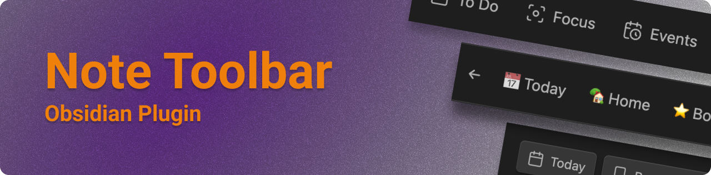
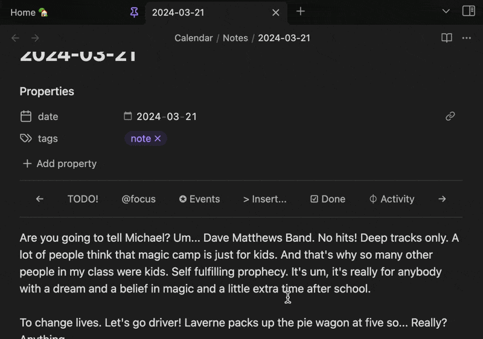
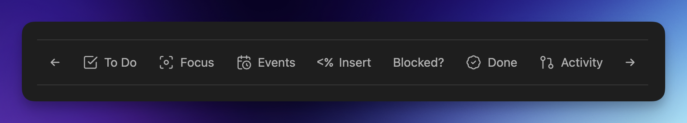
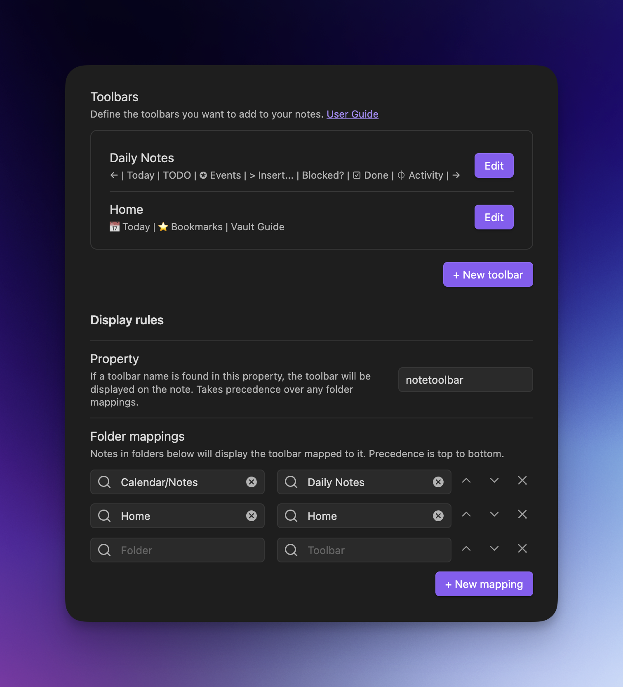

    

The Note Toolbar plugin for [Obsidian](https://obsidian.md) provides a flexible way to create toolbars at the top of your notes, which can include commands, and links to vault files or websites/URIs.

With this plugin, you also get [Note Toolbar Callouts](https://github.com/chrisgurney/obsidian-note-toolbar/wiki/Note-Toolbar-Callouts) which you can add anywhere in your notes.

📖 **How to use this plugin: [User Guide](https://github.com/chrisgurney/obsidian-note-toolbar/wiki)**

# Features

For the latest additions, see the [Release Notes](https://github.com/chrisgurney/obsidian-note-toolbar/releases).

- [Create toolbars](https://github.com/chrisgurney/obsidian-note-toolbar/wiki/Creating-toolbars) with items that link to Commands, Files, and URIs/URLs
- [Define where and how toolbars are displayed](https://github.com/chrisgurney/obsidian-note-toolbar/wiki/Defining-where-to-show-toolbars): Based on their folders, or a user-defined property
  - [Position each toolbar](https://github.com/chrisgurney/obsidian-note-toolbar/wiki/Positioning-toolbars) below the Properties section, at the top of notes, as a floating button (on mobile)
  - Access the toolbar from the navigation bar (on mobile)
  - Toolbar items can use Obsidian's built-in icons, labels (which can include emojis), or a mix of both
  - Set optional tooltips for each item
  - Show items specifically on mobile, desktop, or both
  - Choose whether the icon, label, or both are displayed
- [Variables](https://github.com/chrisgurney/obsidian-note-toolbar/wiki/Variables) let you sub in the note's title or properties into URIs
- [Note Toolbar Callouts](https://github.com/chrisgurney/obsidian-note-toolbar/wiki/Note-Toolbar-Callouts) let you create and place toolbars anywhere within your notes
- [Style toolbars](https://github.com/chrisgurney/obsidian-note-toolbar/wiki/Styling-toolbars) by adding borders, sticking to the top of your note on scroll, making them look like buttons, and aligning items (left, right, centered, evenly spaced)
  - Change or override these styles on mobile (i.e, phone and tablet)
  - Use any icon for the floating button or nav bar (on mobile)
  - Or use the [Style Settings plugin](https://github.com/chrisgurney/obsidian-note-toolbar/wiki/Style-Settings-plugin-support) for even more options (colors, positioning, sizing, etc.)
- [Commands](https://github.com/chrisgurney/obsidian-note-toolbar/wiki/Commands) to _completely_ toggle hiding of note properties, and to quickly access toolbar configuration
- [Keyboard controls](https://github.com/chrisgurney/obsidian-note-toolbar/wiki/Accessibility) available via the _Note Toolbar: Focus_ command
- Right-click toolbars to quickly change the position, or to access configuration

# Installation

[Click here](https://obsidian.md/plugins?id=note-toolbar) or:

1. Open Obsidian's settings, and click _Community plugins_
2. Search for _Note Toolbar_ and select it
3. _Install_

Installing beta versions via BRAT

 
<a href="https://github.com/TfTHacker/obsidian42-brat">BRAT</a> lets you beta-test plugins, to provide feedback. 
 
As beta versions become available, I welcome <a href="https://github.com/chrisgurney/obsidian-note-toolbar/discussions">your feedback</a> and any <a href="https://github.com/chrisgurney/obsidian-note-toolbar/issues">issues</a> you uncover! 
 
<blockquote>
  <ol>
    <li>Install the BRAT plugin:
      <ul>
        <li>Open <i>Settings > Community Plugins</i></li>
        <li><i>Disable safe mode</i>, if enabled</li>
        <li>Browse, and <i>search for "BRAT"</i></li>
        <li>Install the latest version of <i>Obsidian 42 - BRAT</i></li>
      </ul></li>
    <li>Open BRAT settings (<i>Settings -> Obsidian 42 - BRAT</i>)</li>
    <li>Scroll to the <i>Beta Plugin List</i> section</li>
    <li><i>Add Beta Plugin</i></li>
    <li>Specify this repository: <code>chrisgurney/obsidian-note-toolbar</code></li>
    <li><i>Enable the Note Toolbar plugin</i> (<i>Settings &gt; Community plugins</i>)</li>
    <li>Restart Obsidian, or re-open your vault.</li>
  </ol>
</blockquote>

# Getting Started 🚀

Once enabled, open Note Toolbar's settings:

1. Create a _+ New toolbar_
2. Give the toolbar a _name_.
3. _+ Add toolbar item_
4. Exit settings, and _open a note_.
5. Add a `notetoolbar` property. Set it to the name of your toolbar.

If you want your toolbar to show without using a property, try mapping a folder (like wherever your Daily Notes are stored) to your new toolbar.

# Examples

[See the User Guide](https://github.com/chrisgurney/obsidian-note-toolbar/wiki) for detailed instructions, and [examples](https://github.com/chrisgurney/obsidian-note-toolbar/wiki/Examples).

[Let me know](https://github.com/chrisgurney/obsidian-note-toolbar/discussions/categories/show-and-tell) how you use your toolbars!

# User Guide

📖 **See the [User Guide](https://github.com/chrisgurney/obsidian-note-toolbar/wiki).**

Once installed, in Obsidian go to: _Settings... > Note Toolbar_ and click _+ New toolbar_.

# License

Note Toolbar is licensed under Apache License Version 2.0. See the [LICENSE](https://github.com/chrisgurney/obsidian-note-toolbar/blob/master/LICENSE).

# Inspiration and Thanks 🙏

Shout out to other projects and people who helped me with questions I had while developing this plugin:

- Obsidian's [Sample Plugin](https://github.com/obsidianmd/obsidian-sample-plugin), [developer docs](https://docs.obsidian.md/) and [this playlist](https://www.youtube.com/playlist?list=PLIDCb22ZUTBnMCbJa-st4PD5T3Olep078).
- [Templater](https://github.com/SilentVoid13/Templater) - for code, especially around settings.
- [Periodic Notes](https://github.com/liamcain/obsidian-periodic-notes/) - for code, and one of the reasons this plugin works well for my own needs... and for liam.cain's help!
- [BRAT](https://github.com/TfTHacker/obsidian42-brat) - for the means to beta test this plugin.
- Everybody on the [Obsidian Discord](https://discord.gg/obsidianmd) #plugin-dev channel for their time and documentation, including but not limited to: claremacrae, dovos, lemons_dev, liam.cain, joethei, sailKite, SkepticMystic

# Contribute 🧑‍💻

Happy to [discuss your ideas](https://github.com/chrisgurney/obsidian-note-toolbar/discussions)! Pull requests are welcome!

# Support 🛟

📖 **See [Troubleshooting](https://github.com/chrisgurney/obsidian-note-toolbar/Troubleshooting) in the [User Guide](https://github.com/chrisgurney/obsidian-note-toolbar/wiki).**

[Ask questions here](https://github.com/chrisgurney/obsidian-note-toolbar/discussions) or [request a feature](https://github.com/chrisgurney/obsidian-note-toolbar/discussions/categories/ideas). If you run into something that looks like a bug, please [log an issue](https://github.com/chrisgurney/obsidian-note-toolbar/issues).

If you find this plugin useful, and wish to support me financially, I accept donations. Thank you!

