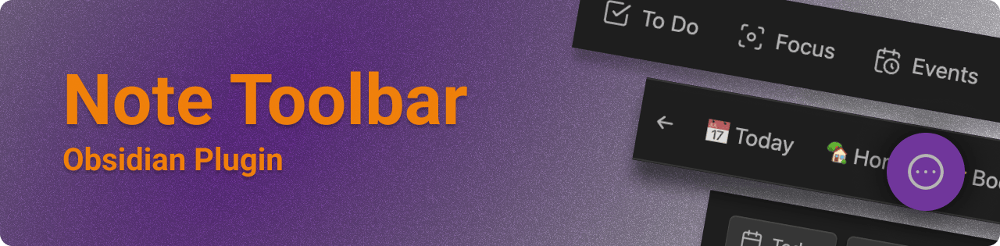
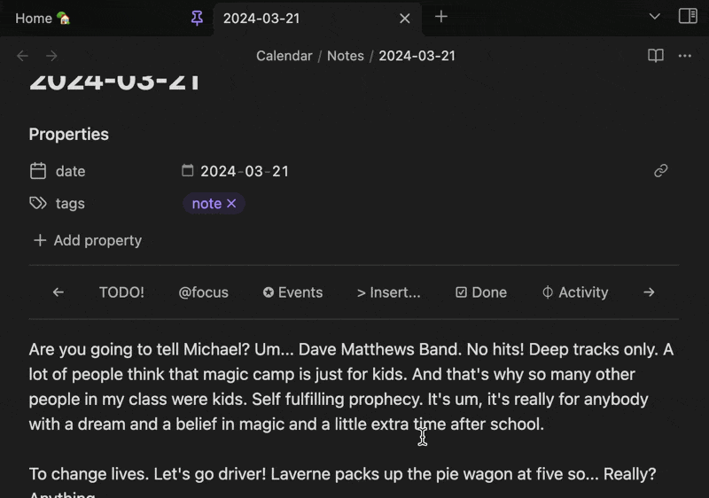
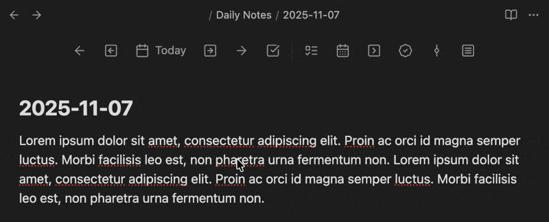
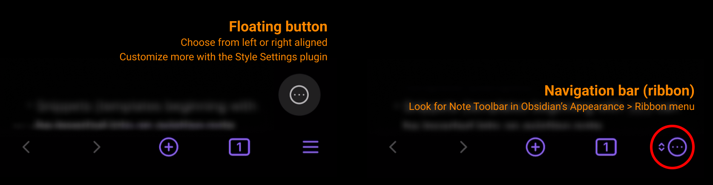
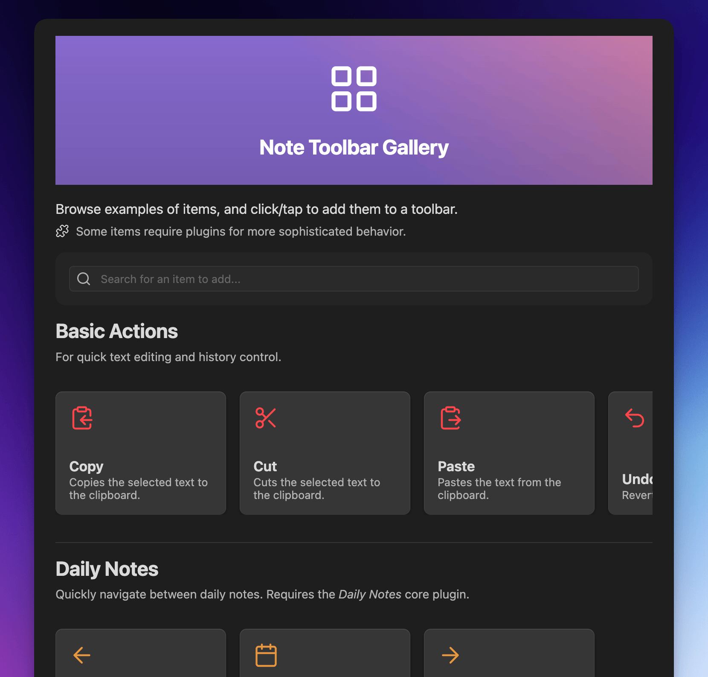
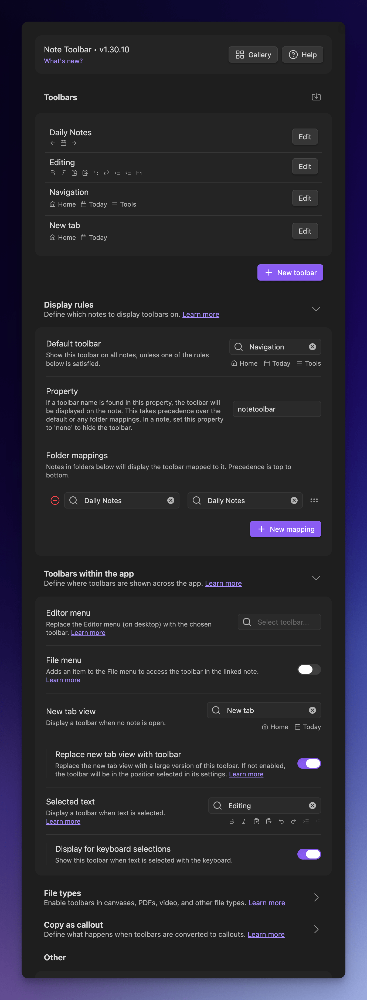
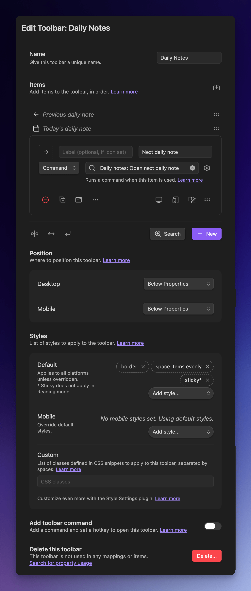

    

English | [中文文档](./README-ZH.md)

The [Note Toolbar plugin](https://obsidian.md/plugins?id=note-toolbar) for [Obsidian](https://obsidian.md) lets you create context-aware toolbars for your notes, which can include commands, file and folder links, websites/URIs, menus, and scripts (Dataview, Templater, and JavaScript).

> What's new? See the [Release Notes](https://github.com/chrisgurney/obsidian-note-toolbar/releases)
> 
> What's ahead? See the [Roadmap](https://github.com/chrisgurney/obsidian-note-toolbar/wiki/Roadmap)

**Jump to:**

- [Features](#features)
- [Installation](#installation)
- [Getting Started](#getting-started-)
- [Gallery](https://github.com/chrisgurney/obsidian-note-toolbar/wiki/Gallery)
- [User Guide](https://github.com/chrisgurney/obsidian-note-toolbar/wiki)

# Screenshots

*Toolbars can stick to the top on scroll:*

*Have a toolbar appear when text is selected:*

*More options on mobile:*

# Features

_🏆 Runner up in the Obsidian Gems of the Year 2024: New plugins category._

- [Create toolbars](https://github.com/chrisgurney/obsidian-note-toolbar/wiki/Creating-toolbars) with items that link to commands, files/folders, URIs/URLs, menus, and [scripts](https://github.com/chrisgurney/obsidian-note-toolbar/wiki/Executing-scripts) (Dataview, JS Engine, Templater, and built-in support for JavaScript).
  - Built-in [Gallery of 100+ items](https://github.com/chrisgurney/obsidian-note-toolbar/wiki/Gallery) that can be added to your toolbars in just a couple clicks/taps.
- [Define where and how toolbars are displayed](https://github.com/chrisgurney/obsidian-note-toolbar/wiki/Defining-where-to-show-toolbars): Based on their folders, or a user-defined property.
  - [Position each toolbar](https://github.com/chrisgurney/obsidian-note-toolbar/wiki/Positioning-toolbars) below the Properties section, at the top or bottom of notes, in the tab bar, or as a floating button.
  - [Show a toolbar when text is selected.](https://github.com/chrisgurney/obsidian-note-toolbar/wiki/Toolbars-within-the-app#Selected-text)
  - Add a toolbar to the _New tab_ view, or [completely replace the New tab view](https://github.com/chrisgurney/obsidian-note-toolbar/wiki/Toolbars-within-the-app#New-tab-view) as a launchpad for your vault.
  - Access the toolbar from the navigation bar (on mobile).
- Use Obsidian's built-in icons, labels (which can include emojis), or a mix of both.
  - Set optional tooltips for each item.
  - Show items specifically on mobile, desktop, or both.
  - Choose whether the icon, label, or both are displayed.
- Use [variables](https://github.com/chrisgurney/obsidian-note-toolbar/wiki/Variables) or script experssions to sub in the note's title or properties and more into toolbar item labels, tooltips, and URIs.
- [Note Toolbar Callouts](https://github.com/chrisgurney/obsidian-note-toolbar/wiki/Note-Toolbar-Callouts) let you create and place toolbars anywhere within your notes.
- [Share toolbars](https://github.com/chrisgurney/obsidian-note-toolbar/wiki/Sharing-toolbars) with other users with a link, or [as callouts](https://github.com/chrisgurney/obsidian-note-toolbar/wiki/Creating-callouts-from-toolbars).
- [Style toolbars](https://github.com/chrisgurney/obsidian-note-toolbar/wiki/Styling-toolbars) by adding borders, sticking to the top of your note on scroll, auto-hiding, choosing whether or not the toolbar should wrap (on mobile), making items look like buttons or act like tabs, and aligning items (left, right, centered, evenly spaced).
  - Change or override these styles on mobile (i.e, phone and tablet).
  - Use any icon for the floating button or [nav bar](https://github.com/chrisgurney/obsidian-note-toolbar/wiki/Navigation-bar) (on mobile).
  - Or use the [Style Settings plugin](https://github.com/chrisgurney/obsidian-note-toolbar/wiki/Style-Settings-plugin-support) for even more options (colors, positioning, sizing, etc.).
- Add [commands](https://github.com/chrisgurney/obsidian-note-toolbar/wiki/Commands) to open any toolbar, or to execute any item. Built-in commands _completely_ hide note properties, quickly access toolbars with [Quick Tools](https://github.com/chrisgurney/obsidian-note-toolbar/wiki/Quick-Tools), get command URIs, and more.
- [Note Toolbar URIs](https://github.com/chrisgurney/obsidian-note-toolbar/wiki/Note-Toolbar-URIs) let you execute commands, focus on folders, open menus (within Note Toolbar Callouts), and open toolbar settings, from mostly anywhere within your notes.
- [Keyboard controls](https://github.com/chrisgurney/obsidian-note-toolbar/wiki/Accessibility) available via the _Note Toolbar: Focus_ command
- Right-click toolbars to swap with other toolbars, quickly change the position, style, or to access configuration.
- The [Note Toolbar API](https://github.com/chrisgurney/obsidian-note-toolbar/wiki/Note-Toolbar-API) provides toolbar access, and the ability to show UI (suggesters, prompts, menus, and modals). The latter enables Dataview JS, JS Engine, or Templater scripts to ask for information, or to show helpful text.

# Translations 🌐

Note Toolbar's UI, and Style Settings options, are also available in:

|Language name|Native name|Contributors|
|---|---|---|
|Chinese (Simplified)|简体中文|[@Moyf](https://github.com/Moyf)|
|German|Deutsch|[@hartimd](https://github.com/hartimd)|
|Ukrainian|Український|[@Laktiv](https://github.com/laktiv)|

[Help add more translations.](https://github.com/chrisgurney/obsidian-note-toolbar/wiki/Help-translate-Note-Toolbar-%F0%9F%8C%90)

# Installation

[Click here](https://obsidian.md/plugins?id=note-toolbar) or:

1. Open Obsidian's settings, and click _Community plugins_
2. Search for _Note Toolbar_ and select it
3. _Install_
4. Make sure to _Enable_ the plugin

Installing beta versions via BRAT

 
<a href="https://github.com/TfTHacker/obsidian42-brat">BRAT</a> lets you beta-test plugins, to provide feedback. 
 
As beta versions become available, I welcome <a href="https://github.com/chrisgurney/obsidian-note-toolbar/discussions">your feedback</a> and any <a href="https://github.com/chrisgurney/obsidian-note-toolbar/issues">issues</a> you uncover! 
 
<em>Disclaimer: Betas are pre-release versions of the plugin. It is strongly encouraged to make a backup of your Note Toolbar's <code>data.json</code> file before proceeding, and/or test within a separate vault (depending on the nature of the beta).</em> 
 
<blockquote>
  <ol>
    <li>Install the BRAT plugin:
      <ul>
        <li>Open <i>Settings > Community Plugins</i></li>
        <li><i>Disable safe mode</i>, if enabled</li>
        <li>Browse, and <i>search for "BRAT"</i></li>
        <li>Install the latest version of <i>Obsidian 42 - BRAT</i></li>
      </ul></li>
    <li>Open BRAT settings (<i>Settings -> Obsidian 42 - BRAT</i>)</li>
    <li>Scroll to the <i>Beta Plugin List</i> section</li>
    <li><i>Add Beta Plugin</i></li>
    <li>Specify this repository: <code>chrisgurney/obsidian-note-toolbar</code></li>
    <li><i>Enable the Note Toolbar plugin</i> (<i>Settings &gt; Community plugins</i>)</li>
    <li>Restart Obsidian, or re-open your vault.</li>
    <li>In Note Toolbar's settings, confirm the version number at the top is the latest beta version.</li>
  </ol>
</blockquote>

# Getting Started 🚀

Once enabled, open Note Toolbar's settings:

1. Create a _+ New toolbar_
2. Give the toolbar a _name_.
3. _+ Add_ (or search the [Gallery](https://github.com/chrisgurney/obsidian-note-toolbar/wiki/Gallery))
4. Exit settings, and _open a note_.
5. Add a `notetoolbar` property. Set it to the name of your toolbar.

If you want your toolbar to show _without_ using a property, try mapping a folder (like wherever your Daily Notes are stored) to your new toolbar.

# Example

📖 [See the User Guide](https://github.com/chrisgurney/obsidian-note-toolbar/wiki) for detailed instructions, and tips, and [the discussions](https://github.com/chrisgurney/obsidian-note-toolbar/discussions/categories/show-and-tell) for examples.

# Gallery

In the Gallery, **[explore 100+ items](https://github.com/chrisgurney/obsidian-note-toolbar/wiki/Gallery)** that can be added to toolbars in just a couple clicks/taps.

# User Guide

📖 **See the [User Guide](https://github.com/chrisgurney/obsidian-note-toolbar/wiki)** for detailed instructions, tips, and lots more.

Screenshots of Note Toolbar's configuration:

# License

Note Toolbar is licensed under GPL 3.0. See the [LICENSE](https://github.com/chrisgurney/obsidian-note-toolbar/blob/master/LICENSE).

# Inspiration and Thanks 🙏

Shout out to other projects and people who helped me with questions I had while developing this plugin:

- Obsidian's [Sample Plugin](https://github.com/obsidianmd/obsidian-sample-plugin), [developer docs](https://docs.obsidian.md/) and [this playlist](https://www.youtube.com/playlist?list=PLIDCb22ZUTBnMCbJa-st4PD5T3Olep078).
- [Templater](https://github.com/SilentVoid13/Templater) - for code, especially around settings.
- [Periodic Notes](https://github.com/liamcain/obsidian-periodic-notes/) - for code, and one of the reasons this plugin works well for my own needs... and for liam.cain's help!
- [BRAT](https://github.com/TfTHacker/obsidian42-brat) - for the means to beta test this plugin.
- Everybody on the [Obsidian Discord](https://discord.gg/obsidianmd) #plugin-dev channel for their time and documentation, including but not limited to: claremacrae, dovos, lemons_dev, liam.cain, joethei, sailKite, SkepticMystic

# Contribute 🧑‍💻

Happy to [discuss your ideas](https://github.com/chrisgurney/obsidian-note-toolbar/discussions)! Pull requests are welcome!

[Help add or review translations.](https://github.com/chrisgurney/obsidian-note-toolbar/wiki/Help-translate-Note-Toolbar-%F0%9F%8C%90)

# Support 🛟

📖 **See [Troubleshooting](https://github.com/chrisgurney/obsidian-note-toolbar/Troubleshooting) in the [User Guide](https://github.com/chrisgurney/obsidian-note-toolbar/wiki).**

[Ask questions here](https://github.com/chrisgurney/obsidian-note-toolbar/discussions) or [request a feature](https://github.com/chrisgurney/obsidian-note-toolbar/discussions/categories/ideas). If you run into something that looks like a bug, please [log an issue](https://github.com/chrisgurney/obsidian-note-toolbar/issues).

If you find this plugin useful, and wish to support me financially, [I accept donations](https://buymeacoffee.com/cheznine). Thank you!

