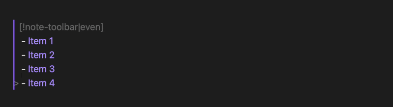
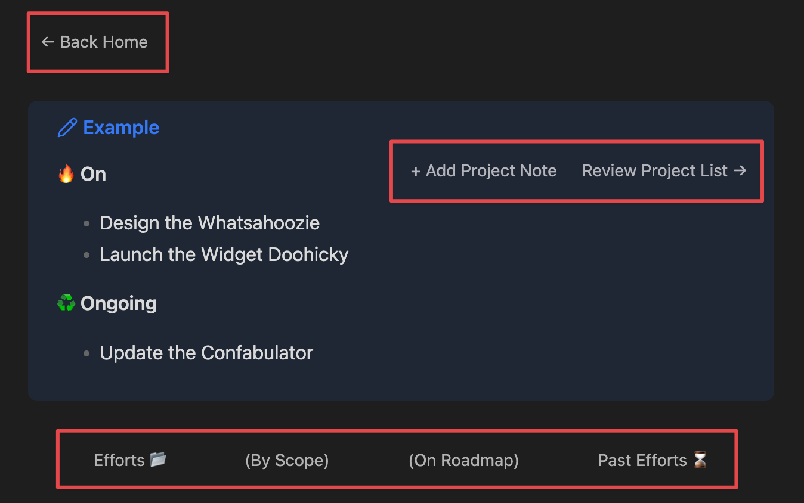

# Note Toolbar

The Note Toolbar plugin for [Obsidian](https://obsidian.md) provides a flexible way to create toolbars at the top of your notes.

With this plugin, you also get [Note Toolbar Callouts](#use-toolbar-callouts) which you can add anywhere in your notes.

[](https://github.com/chrisgurney/obsidian-note-toolbar/releases)
[](https://opensource.org/licenses/Apache-2.0)


# Installation

## Installing via Community Plugins

- [ ] TBD

## Installing via BRAT

1. Install the BRAT plugin:
  - Open _Settings > Community Plugins_
  - _Disable safe mode_, if enabled
  - Browse, and _search for "BRAT"_
  - Install the latest version of _Obsidian 42 - BRAT_
2. Open BRAT settings (_Settings -> Obsidian 42 - BRAT_)
3. Scroll to the _Beta Plugin List_ section
4. _Add Beta Plugin_
5. Specify this repository: `chrisgurney/obsidian-note-toolbar`
6. _Enable the Note Toolbar plugin_ (_Settings -> Community Plugins_)

# Getting Started 🚀

Once installed and enabled, in Note Toolbar's settings:

1. Create a _+ New toolbar_
2. Give the toolbar a _name_.
3. _+ Add toolbar item_
4. Exit settings, and _open a note_.
5. Add a `notetoolbar` property. Set it to the name of your toolbar.

Try mapping a folder, like whever your Daily Notes are stored, to your new toolbar.

# Examples

Any plugin that can generate a URL can be executed from the toolbar. Some examples:

| Example | How? |
| --- | --- |
| Next, Previous, and Today's Daily Note | Use [Periodic Notes](https://github.com/liamcain/obsidian-periodic-notes) + [Advanced URI](https://github.com/Vinzent03/obsidian-advanced-uri) to get the relevant links: Run `Advanced URI: get URI for command` > `<Don't specify a file>` > `Periodic Notes: Open next daily note` |
| Insert Template | Use [Templater](https://github.com/SilentVoid13/Templater)'s `Open insert template modal` command + [Advanced URI](https://github.com/Vinzent03/obsidian-advanced-uri) |
| Bookmarks | Open the Bookmarks panel with the `Bookmarks: Show bookmarks` command + [Advanced URI](https://github.com/Vinzent03/obsidian-advanced-uri), OR use a [Note Toolbar Callout](#use-toolbar-callouts) and [Dataview](https://github.com/blacksmithgu/obsidian-dataview) to generate a toolbar with your top bookmarks. |
| Execute Shell Commands | Using the [Shell Commands](https://github.com/Taitava/obsidian-shellcommands) plugin. |

[Let me know](https://github.com/chrisgurney/obsidian-note-toolbar/discussions) how you use your toolbars!

# Settings Guide 🛠️

Once installed, in Obsidian go to: _Settings... > Note Toolbar_ and click _+ New toolbar_.


## Creating Note Toolbars

### Name

Give your toolbar a name. This name will be used from your note properties, or when mapping folders (see below).

### Items

Add each item to your toolbar:

| Setting | What it does |
| --- | --- |
| Item label | What's shown on the toolbar |
| Tooltip | Displayed on hovering over the item on the toolbar. Nothing is displayed if this is not set. |
| URL | What the item links to. See the [URLs](#urls) section. |
| Hide on mobile | Enable this to simplify your experience on mobile due to limited screen real-estate, or for items that just don't work on mobile (e.g., Shell Commands). |
| Hide on desktop | If you have items you prefer not to see on desktop. |

#### URLs

Toolbar items can link to notes, or URLs (linking to internal or external locations).

The following variables are supported, which are substituted on click:

| Variable | What it is |
| --- | --- |
| `{{note_title}}` | The title (a.k.a. basename) of the current note. |
| `{{prop_NAME}}` | Property in the current note with the given name. If the property does not exist, the variable will not be substitued. e.g., if you have a property called "date" use `{{prop_date}}` |

Variable values are [encoded](https://developer.mozilla.org/en-US/docs/Web/JavaScript/Reference/Global_Objects/encodeURIComponent) for safety.

[Let me know](https://github.com/chrisgurney/obsidian-note-toolbar/discussions) what else you might want to add.

### Styles

Styles define how the toolbar will look (and behave).

Add them to the _Defaults_ section. In the _Mobile_ section, you can add equivalent styles that allow you to override these defaults, on mobile.

| Style | Clarification |
| --- | --- |
| border | adds a top and bottom border |
| no border | |
| center items | |
| evenly space items | |
| float left | floats the toolbar left of nearby content |
| float right | floats the toolbar right of nearby content |
| no float | |
| left align items | |
| right align items | |
| sticky | sticks toolbar to top on scroll |
| not sticky | |

_Notes on precedence:_
- Styles are applied in the order you add them in settings. Per how CSS works, styles later in the lists take precedence.
- In case it helps, styles are defined alphabetically in [styles.css](https://github.com/chrisgurney/obsidian-note-toolbar/blob/master/styles.css) (with the exception of float being at the top).

## Defining where Note Toolbars are applied

Tell the plugin which notes to display toolbars on, in one of two ways: based on a property, or based on the folder the note is in.

### Note property

Set the `notetoolbar` property on your note with the name of the toolbar you want to display.

Change what property to use by looking at by changing the `Property` setting.

If you prefer not to use properties, try Folder Mappings.

### Folder Mappings

Specify the folders you want your toolbars to appear on.

For example, if your daily notes are all in the same root folder, just specify that folder and map it to your "Daily Notes" toolbar, and it will appear on all existing, and new daily notes.

_Notes on precedence_:
- Notes are matched to folders starting from the top of the list.
- If you have a property on a given note, it will override the folder mapping.

# Use Toolbar Callouts

Toolbars are actually callouts! You can use a toolbar callout directly, to add a toolbar in the middle of your notes, for example. 



This feature allows for more flexibility, and using other plugins (e.g., Templater, Dataview) to generate the contents of the toolbar.

## How to use Toolbar Callouts

Create a toolbar by creating a callout containing any list, like this:
```markdown
> [!note-toolbar]
> - [Link Menu Item](obsidian://...)
> - [[Page Menu Item]]
> - Menu Item That Won't Do Anything
```

To control its appearance, optionally add metadata by adding a | and listing styles, for example:
```markdown
> [!note-toolbar|border-right-sticky]
```

Refer directly to the [styles.css](https://github.com/chrisgurney/obsidian-note-toolbar/blob/master/styles.css) for the literal style names.

Examples:



# Troubleshooting

## I want to link a toolbar item to a note...

I'm investigating adding this in addition to URLs, but in the meantime you can get the URL from Obsidian itself (`Copy Obsidian URL`).

## The styling of my toolbar looks weird...

See the notes in the [Styles](#styles) section around precedence.

However, if you use other plugins or themes that modify how callouts behave or look, they _may_ have an effect on this plugin. 

As noted, toolbars are a special form of callout, designed to fit naturally with Obsidian's look and feel. The plugin inserts between the metadata and content portions of the editor view, assuming certain criteria are met.

Please [log an issue](https://github.com/chrisgurney/obsidian-note-toolbar/issues) if you think there’s a conflict with a theme, for example, that can be resolved in the plugin itself (e.g., missed a style that needs to be overridden). Pull requests are also welcome.

If you prefer to workaround any issues in the short term, styling is handled in [styles.css](https://github.com/chrisgurney/obsidian-note-toolbar/blob/master/styles.css) by `.callout[data-callout="note-toolbar"]`.

# License

Note Toolbar is licensed under Apache License Version 2.0. See the [LICENSE](https://github.com/chrisgurney/obsidian-note-toolbar/blob/master/LICENSE).

# Inspiration and Thanks 🙏

Shout out to other projects and people who helped me with questions I had while developing this plugin:

- Obsidian's [Sample Plugin](https://github.com/obsidianmd/obsidian-sample-plugin), [developer docs](https://docs.obsidian.md/) and [this playlist](https://www.youtube.com/playlist?list=PLIDCb22ZUTBnMCbJa-st4PD5T3Olep078).
- [Templater](https://github.com/SilentVoid13/Templater) - for code, especially around settings.
- [Periodic Notes](https://github.com/liamcain/obsidian-periodic-notes/) - for code, and one of the reasons this plugin works well for my own needs... and for liam.cain's help!
- [BRAT](https://github.com/TfTHacker/obsidian42-brat) - for the means to beta test this plugin.
- Everybody on the [Obsidian Discord](https://discord.gg/obsidianmd), for their time and documentation, including but not limited to: claremacrae, lemons_dev, liam.cain, dovos, and joethei.

Thank you to all the plugins that Note Toolbar can utilize:

- [Advanced URI](https://github.com/Vinzent03/obsidian-advanced-uri) for linking to commands from:
  - [Templater](https://github.com/SilentVoid13/Templater)
  - [Dataview](https://github.com/blacksmithgu/obsidian-dataview) (e.g., generate a list of your Bookmarks)
  - [Periodic Notes](https://github.com/liamcain/obsidian-periodic-notes) (link to today's, and previous/next Daily Notes)
- [Shell Commands](https://github.com/Taitava/obsidian-shellcommands) (for executing shell scripts, Python code, etc.)

# Contribute 🧑‍💻

Happy to [discuss your ideas](https://github.com/chrisgurney/obsidian-note-toolbar/discussions)! If they sound good, pull requests are welcome!

# Support 🛟

[Log an issue](https://github.com/chrisgurney/obsidian-note-toolbar/issues) or [ask a question](https://github.com/chrisgurney/obsidian-note-toolbar/discussions)!